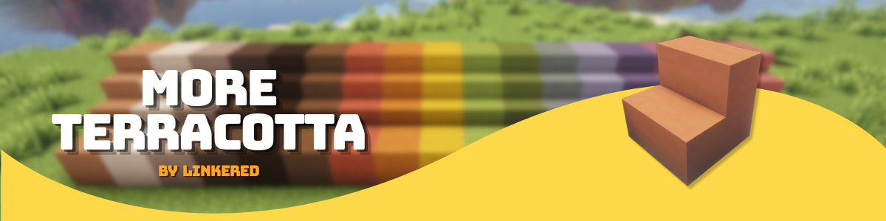

# More Terracotta

> **Minecraft 26.3 finally gave wool and concrete their own stairs and slabs… so where's terracotta?**
> Still waiting by the kiln.

**More Terracotta** fires up the missing pieces: stairs and slabs for plain Terracotta and all 16 dyed colors,
built to look and feel like they shipped with the game.

## Features

- **34 new blocks:** stairs and a slab for Terracotta and for each dyed Terracotta.
- **Feels vanilla:** same hardness, blast resistance, sounds and mining rules as the terracotta it is made from.
- **Resource-pack friendly:** uses only the vanilla terracotta textures, so the new blocks automatically match any
  resource pack that retextures terracotta. No extra textures are added.
- **Waterloggable**, like every vanilla slab and stair.
- **Recipes:** crafting table and stonecutter, unlocked in the recipe book as soon as you pick up the matching terracotta.
- **Creative menu:** found in the Colored Blocks tab, right after vanilla terracotta.

## License

Licensed under the [Mozilla Public License 2.0](LICENSE).
